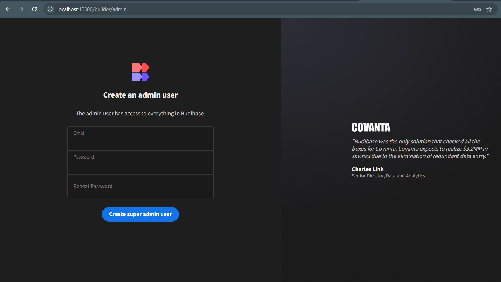
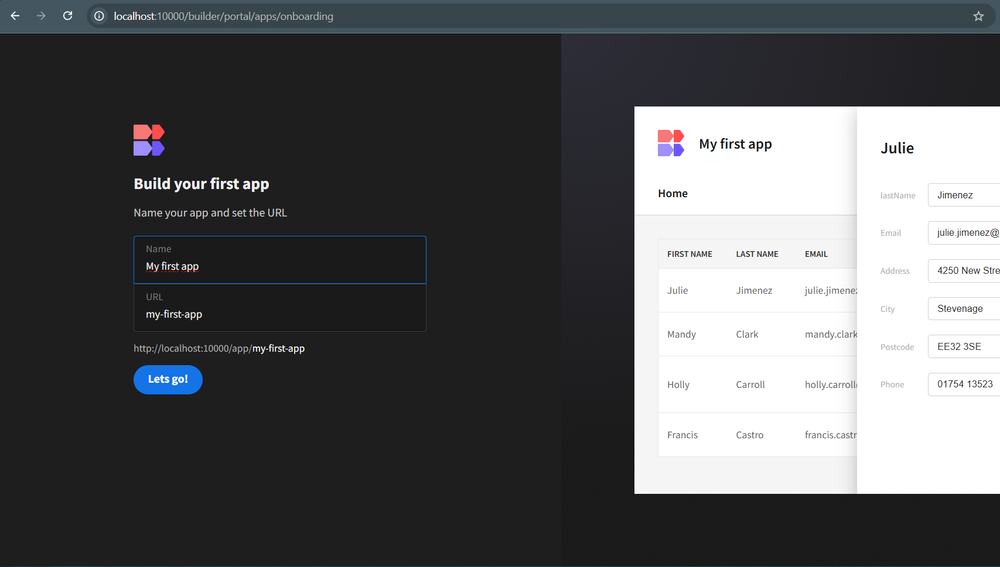
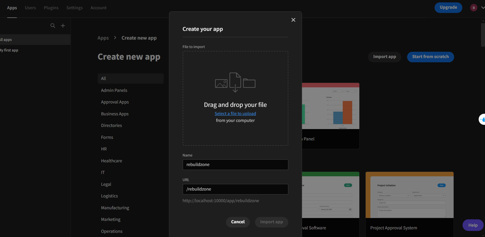

<a href="https://flask.palletsprojects.com/en/stable/"> </a>
<a href="https://flask.palletsprojects.com/en/stable/"> </a>
<a href="https://flask.palletsprojects.com/en/stable/"> </a>
<a href="https://flask.palletsprojects.com/en/stable/"> </a>
<a href="https://flask.palletsprojects.com/en/stable/"> </a>
<a href="https://redis.io/"> </a>
<a href="https://www.docker.com/"> </a>

# RebuildZone

RebuildZone được xây dụng với mục tiêu là phát triển một hệ thống cứu trợ khẩn cấp, hỗ trợ nhân đạo trong những thời điểm thiên tai (lũ lụt, sạt lở,..) và đại dịch. Đặc biệt là tại Việt Nam sau khi trải qua đại dịch COVID và bão YAGI.

Dự án được thực hiện trong cuộc thi [Phần Mềm Nguồn Mở-Olympic Tin học Sinh viên Việt Nam 2024](https://www.olp.vn/procon-pmmn/ph%E1%BA%A7n-m%E1%BB%81m-ngu%E1%BB%93n-m%E1%BB%9F). Được được open source theo giấy phép [Apache 2.0](https://www.apache.org/licenses/LICENSE-2.0) bởi đội tác giả _Lazy Sunday Morning (LSM)_.

Để biết thêm chi tiết về cuộc thi, bạn có thể xem tại [vfossa.vn](https://vfossa.vn/tin-tuc/cong-bo-de-thi-noi-dung-phan-mem-nguon-mo-olympic-tin-hoc-sinh-vien-viet-nam-2024-727.html).

Link thuyết trình Canva tại cuộc thi [link](https://www.canva.com/design/DAGYu2oIjn0/Z9J7rGkzynJUEw5MUv9A7w/edit?utm_content=DAGYu2oIjn0&utm_campaign=designshare&utm_medium=link2&utm_source=sharebutton)

## Mục lục

1. [Giới Thiệu](#Giới-Thiệu)
2. [Chức Năng](#chức-năng-chính)
3. [Tổng Quan Hệ Thống](#kiến-trúc-hệ-thống)
4. [Cấu Trúc Thư Mục](#cấu-trúc-thư-mục)
5. [Hướng Dẫn Cài Đặt](#hướng-dẫn-cài-đặt)
6. [CI/CD](#ci/cd)
7. [Đóng Góp](#đóng-góp-cho-dự-án)
8. [Bản Quyền](#bản-quyền)

## Giới Thiệu

## Chức Năng Chính

Project tập trung vào các chức năng chính như sau:

1. Khai báo cá nhân (Sức khỏe, hiện trạng và tình huống khẩn cấp)
2. Kết hợp xử lý ảnh hỗ trợ đưa ra dự đoán và thống kê thiệt hại.
3. Quản lỷ quyên góp và hỗ trợ nhân đạo
4. Gọi ý đưa ra quyết định
5. Chatbot hỗ trợ tư vấn sức khỏe và xử lý tình huống
6. Hỗ trợ đa ngôn ngữ đối với người ngoại quốc tại Việt Nam

## Kiến trúc hệ thống


## Cấu trúc thư mục

```
rebuild-zone/
├── chatbot-server/           # (Flask server) - AI Chatbot
│   ├── instance/             # SQLite database for saving chat history
│   ├── app.py                # Main application
│   ├── requirements.txt      # Python dependencies for the environment
│   └── Dockerfile
│
├── xray-server/              # (Flask server) - ChestXray
│   ├── imageutil/            # Implements GradCAM technique
│   ├── models/               # CNN models
│   ├── app.py
│   ├── requirements.txt
│   └── Dockerfile
│
├── budibase/                 # Budibase
│   ├── attachments/          # Image attachments
│   ├── budibase-client.js    # Django project settings and configurations
│   ├── db.txt                # Budibase built-in database configuration & data
│   └── manifest.js
└── docker-compose.yml        # Docker Compose for gather configuration
```

## Hướng dẫn cài đặt

### A. Cài đặt Budibase

#### Bước 1: Cài đặt Docker

1. **Cài đặt Docker**:

   - Truy cập vào trang chính thức của Docker để tải và cài đặt Docker: [Docker Get Started](https://docs.docker.com/get-docker/).
   - Sau khi cài đặt, xác nhận Docker đã được cài đặt thành công bằng cách mở terminal và chạy lệnh:
     ```bash
     docker --version
     ```
   - Bạn cũng có thể kiểm tra trạng thái Docker daemon với:
     ```bash
     docker info
     ```

2. **Cài đặt Docker Compose (Tùy chọn)**:
   - Nếu bạn muốn sử dụng Docker Compose (để chạy Budibase cùng với MongoDB, ví dụ), bạn có thể tải Docker Compose từ [Docker Compose Documentation](https://docs.docker.com/compose/install/).
   - Sau khi cài đặt Docker Compose, kiểm tra lại phiên bản:
     ```bash
     docker-compose --version
     ```

#### Bước 2: Chạy Budibase trong Docker

Lệnh này sẽ khởi động cả Budibase và MongoDB trong hai container riêng biệt. Bạn có thể truy cập Budibase qua http://localhost:10000.

```bash
docker-compose up -d
```

#### Bước 3: Tạo tài khoản đăng nhập



#### Bước 4: Tạo app mặc định



#### Bước 5: Thêm app mà bạn đã tải về


Sau khi import xong thì vào tab ẩn danh và điền url http://localhost:10000/builder/portal/{ten-app} để trải nghiệm

### Cài đặt Flask App

#### Bước 1: Cài đặt Python và các công cụ cần thiết

- Cài đặt Python:

  Đảm bảo rằng bạn đã cài đặt Python (phiên bản 3.6 trở lên). Bạn có thể tải Python từ Python Official Website.
  Kiểm tra phiên bản Python đã cài đặt bằng lệnh:

  ```bash
  python --version
  ```

- Cài đặt pip:

  ```bash
  python -m ensurepip --upgrade
  ```

#### Bước 2: Cài đặt các phụ thuộc của Flask app

- Di chuyển vào từng thư mục chatbot-server và xray-server và thực thi câu lệnh bên dưỡi cho mỗi thư mục.

  ```bash
  cd rebuild-zone/chatbot-server
  cd rebuild-zone/xray-server
  ```

- Cài đặt các phụ thuộc từ requirements.txt:

  Trong thư mục của Flask app, chạy lệnh sau để cài đặt tất cả các phụ thuộc đã được liệt kê trong file requirements.txt:

  ```bash
  pip install -r requirements.txt
  ```

#### Bước 3: Cấu hình và Chạy Flask

Bạn có thể liên hệ qua [email](mailto://2151013029huy@ou.edu.vn) để có thể truy cập miễn phí vào sandbox đã được nhóm public

- Cài đặt biến môi trường theo mẫu từ file [/.env.example](https://github.com/anhtuan284/rebuild-zone/blob/developer/.env.example):

```bash
# BACK-END ENV
FLASK_APP=app.py
# For xray-server
CLOUDINARY_CLOUD_NAME=
CLOUDINARY_API_KEY=
CLOUDINARY_API_SECRET=
SENTRY_DNS=

# For chat server
OPENAI_API_KEY=openAPIKey
...
```

- Sau khi cài đặt xong các phụ thuộc, bạn có thể chạy Flask app bằng lệnh:

```bash
python3 -m flask run
```

Nếu mọi thứ hoạt động bình thường, bạn sẽ thấy một thông báo rằng Flask app đang chạy, ví dụ:

- Running on http://127.0.0.1:5000/ (Press CTRL+C to quit)

## Đóng góp cho dự án

<a href="https://github.com/anhtuan284/rebuild-zone/issues/new?assignees=&labels=&projects=&template=bug_report.md&title=Bug+Report%3A+">Bug Report ⚠️
</a>

<a href="https://github.com/anhtuan284/rebuild-zone/issues/new?assignees=&labels=&projects=&template=feature_request.md&title=RequestFeature:">Request Feature 👩‍💻</a>

Nếu bạn muốn đóng góp cho dự án, hãy đọc [CONTRIBUTING.md](.github/CONTRIBUTING.md) để biết thêm chi tiết.

Mọi đóng góp của các bạn đều được trân trọng, đừng ngần ngại gửi pull request cho dự án.

## Liên hệ

- Trần An Tiến: 2151013099tien@ou.edu.vn
- Võ Quốc Huy: 2151013029huy@ou.edu.vn
- Trương Bùi Anh Tuấn: dev.atuan03@gmail.com

## Bản quyền

This project is licensed under the terms of the [APACHE-2.0](LICENSE) license.
